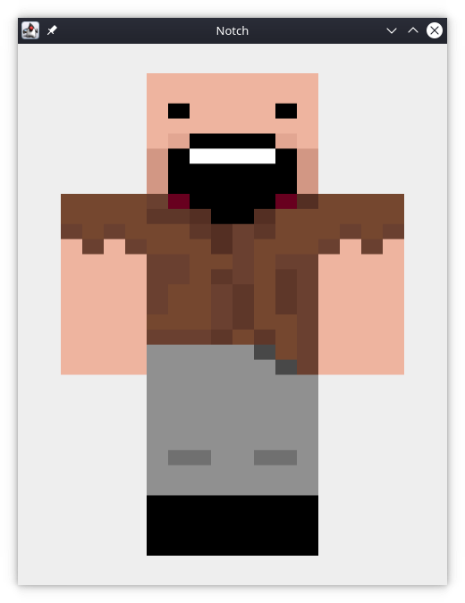
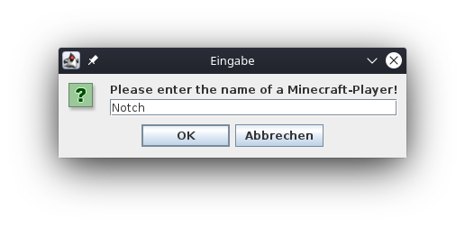

# SkinCrawler 

  

#### Quickly grab Minecraft-Skins with their player name

- Written with OpenJDK-8
- Compatible with Windows, Mac-OS and Linux


# Installation

**SkinCrawler can be easily installed by [downloading the jar-File in the Release-section.](https://github.com/DevEmperor/SkinCrawler/releases/tag/v1.1)**

If you are on Windows and haven't installed Java (Java Runtime Environment (JRE)), you can do this by simply clicking [on this link](https://javadl.oracle.com/webapps/download/AutoDL?BundleId=242990_a4634525489241b9a9e1aa73d9e118e6).

On Linux, Java is typically pre-installed. If not you can install it very simple from your packet manager. 


You can also clone this repository by running 

```bash
git clone https://github.com/DevEmperor/SkinCrawler.git
```

and convert it to a jar-file yourself with the "*jar*"-command from your terminal.


# Usage

The usage of SkinCrawler is very easy:

1. Run the "SkinCrawler_1.0.jar"-file
2. Enter the name of the Minecraft-player
3. Wait a moment until you see his/her Skin
4. Now you can export either the original skin.png-file or the front-skin, which you are currently seeing


*If you prefer faster access to this tool, you could set a shortcut in your system-settings for it*.


# License

SkinCrawler is under the terms of the [Apapche 2.0 license](https://www.apache.org/licenses/LICENSE-2.0), following all clarifications stated in the [license file](https://raw.githubusercontent.com/DevEmperor/SkinCrawler/master/LICENSE).

